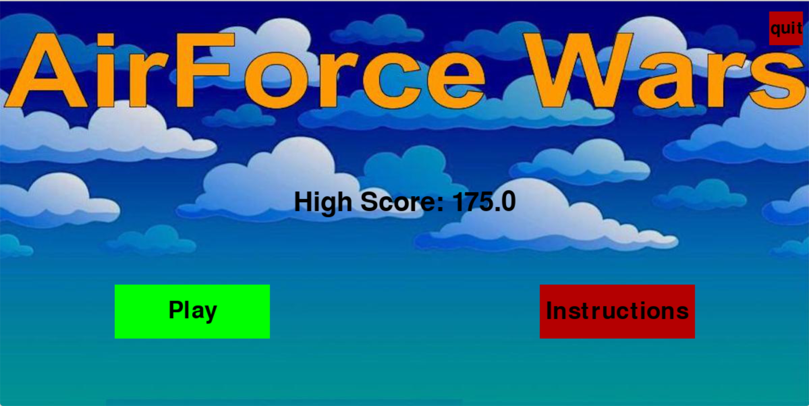
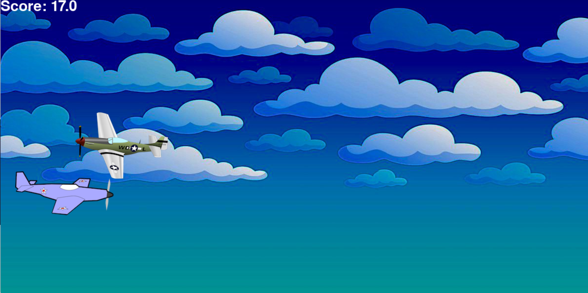
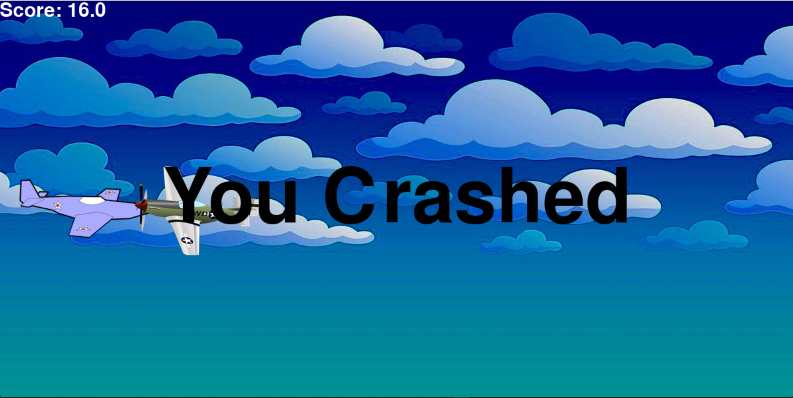

# AirForceWars

The following application is an endless runner game programmed in Python. The program utilizes the Pygame library which allowed me to develop the front end and all game physics of this application, creating a smooth and enjoyable arcade style game. 

 

  
